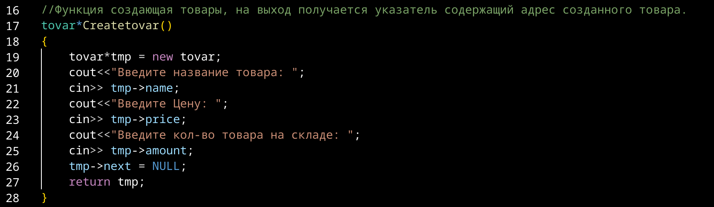

---
## Front matter
title: "Отчет по Лаборатоорной работе №1"
subtitle: "Технология программирования"
author: "Бекауов Артур Тимурович"

## Generic otions
lang: ru-RU
toc-title: "Содержание"

## Bibliography
bibliography: bib/cite.bib
csl: pandoc/csl/gost-r-7-0-5-2008-numeric.csl

## Pdf output format
toc: true # Table of contents
toc-depth: 2
lof: true # List of figures
lot: true # List of tables
fontsize: 14pt
linestretch: 1.5
papersize: a4
documentclass: scrreprt
## I18n polyglossia
polyglossia-lang:
  name: russian
  options:
	- spelling=modern
	- babelshorthands=true
polyglossia-otherlangs:
  name: english
## I18n babel
babel-lang: russian
babel-otherlangs: english
## Fonts
mainfont: PT Serif
romanfont: PT Serif
sansfont: PT Sans
monofont: PT Mono
mainfontoptions: Ligatures=TeX
romanfontoptions: Ligatures=TeX
sansfontoptions: Ligatures=TeX,Scale=MatchLowercase
monofontoptions: Scale=MatchLowercase,Scale=0.9
## Biblatex
biblatex: true
biblio-style: "gost-numeric"
biblatexoptions:
  - parentracker=true
  - backend=biber
  - hyperref=auto
  - language=auto
  - autolang=other*
  - citestyle=gost-numeric
## Pandoc-crossref LaTeX customization
figureTitle: "Рис."
tableTitle: "Таблица"
listingTitle: "Листинг"
lofTitle: "Список иллюстраций"
lotTitle: "Список таблиц"
lolTitle: "Листинги"
## Misc options
indent: true
header-includes:
  - \usepackage{indentfirst}
  - \usepackage{float} # keep figures where there are in the text
  - \floatplacement{figure}{H} # keep figures where there are in the text
---

# Цель работы

Целью работы является написание написание программы на с++, содержащей описание структуры, набор функций для работы со списком на базе этой структуры и функцию main, использующую вышеописанный инструментарий.

# Ход лабораторной работы

Программа, написанная мной задаёт структуру, экземплярами которой, будут товары, описываемые тремя полями - название, цена и кол-во товара.
Четвертое поле задаёт односвязный список.

Далее будут описанны функции предназначенные для работы со списком:
-Добавление товара в начало списка - AddFirst;
-Добавление товара в конец списка - AddLast;
-Добавление товара в список после названия заданного товара - AddAfter;
-Добавление элемента в список перед заданным элементом - AddBefore;
-Удаление из списка элемента с заданным именем - Deltovar;
-Вывод содержания списка на экран - printlist;

Затем будет описанна функция main, которая позволяет взаимодействовать со списком, с помощью перечисленных функций.

**Описание структуры**

{#fig:1}

Программа начинается с описания структуры, которую я назвал tovar. (Рис. @fig:1).
Структура имеет три поля, описывающие сам товар: name - название (строка),
price - цена (переменная с плавающей точкой), и amount - кол-во (целое число). Четвертое поле next - задаёт односвязный список и являет собой адрес следующего элемента.

**Функция, создающая товар**

{#fig:2}

Далее, я описал функцию Createtovar, создающую новый экземпляр структуры tovar, результатом работы которой является адрес памяти, в которой создан новый товар. (Рис. @fig:2)
Сделал я это, чтобы сократить текст функции main, хотя и без этой функции можно было бы легко обойтись. 

**Функция AddFirst**

{#fig:3}

Затем, мной была написана функция AddFirst(Рис. @fig:3), которая получает на вход ссылку на переменную tlist с адресом первого элемента списка, и адрес памяти созданного элемента. Адрес первого элемента поступает именно ввиде ссылки (&tlist), т.к. значение переменной адреса первого элемента меняется в ходе работы функции.
Функция работает по следующему принципу - в поле нового элемента, задающее список, записывается адрес первого (на момент начала работы функции) элемента. Затем переменная tlist (обозначающая начало списка) принимает значение адреса нового элемента.
Таким образом новый товар становится первым в списке, т.е. добавляется в начало списка.

**Функция AddAfter**

{#fig:4}

После этого я описал функцию AddAfter(Риc. @fig:4), которая получает на вход ссылку на переменную tlist с адресом первого элемента списка, адрес памяти созданного элемента и название элемента, после которого нужно вставить новый элемент.
Функция работает по следующему принципу - в начале цикл while проходит  по списку (от первого элемента, до элемента который ссылается в NULL) в поисках элемента название которого соответствует искомогу, если находит - то останавливается и фиксирует в переменной n адрес памяти этого элемента. Если не находит - то фиксирует в переменной n адрес последнего элемента списка. Затем в поле нового элемента, задающее список, записывается адрес элемента следующего за n. А в поле элемента n, задающее список, записывается адрес нового элемента.
Таким образом, новый товар включается в список сразу после элемента с искомым названием или если такой элемент отсутствует - становится последним в списке.

**Функция AddBefore**

{#fig:5}

Далее, я описал функцию AddBefore(Рис. @fig:5), которая получает на вход ссылку на переменную tlist с адресом первого элемента списка, адрес памяти созданного элемента и название элемента, перед которым нужно вставить новый элемент.
Функция работает по следующему принципу - в начале проверяются два условия - если список пустой или название первого элемента списка совпадает с искомым, то новый элемент добавляется в начало списка с помощью функции AddFirst. Если список таким условиям не удовлетворяет, то цикл while проходит по списку в поисках элемента, предшествующего тому, название которого соответствует искомогу. (по аналогии с прошлой функцией можно сказать - "n-1"ый элемент). Если элемент с таким названием есть в списке, то фиксируется n-1ый элемент, если нет - то последний элемент. Затем в поле нового элемента, задающее список, записывается адрес элемента следующего за n-1ым, т.е n-го - имеющего искомое название. А в поле элемента n-1, задающее список, записывается адрес нового элемента. 
Таким образом, новый товар будет добавлен в список перед элементом с искомым названием, или если такой элемент отсутствует - то в конец.

**Функция AddLast**

{#fig:6}

Затем, мной была написана функция AddLast(Рис. @fig:6), которая получает на вход ссылку на переменную tlist с адресом первого элемента списка, и адрес памяти созданного элемента.
Функция работает по следующему принципу - в начале проверяется пустой ли список. Если пустой - то новый элемент добавляется в список с помощью AddFirst - и становится единственным элементом списка (первым и последним). Если список не пустой, то цикл while проходит по списку в поисках последнего элемента (который n->next==NULL). Фиксируется последний элемент n. Затем в поле нового элемента, задающее список, записывается адрес NULL. А в поле элемента n, задающее список, записывается адрес нового элемента.
Таким образом, новый товар будет добавлен в конец списка.

**Функция Deltovar**

{#fig:7}

После этого я описал функцию Deltovar(рис. @fig:7), которая получает на вход ссылку на переменную tlist с адресом первого элемента списка и название элемента, который нужно удалить.
Функция работает по следующему принципу - в начале проверяется условие - если список пустой, то выводится сообщение "Список уже пуст" и функция прекращает свою работу. Потом проверяется второе условие - если название первого товара в списке совпадает с названием искомого, то переменная tlist (обозначающая начало списка) принимает значение адреса второго элемента, а память по адресу первого элемента очищается с помощью delete.
Если ни одному из этих условий список не удовлетворяет, то цикл while проходит по списку в поисках элемента, предшествующего тому, название которого соответствует искомогу. (по аналогии с функцией AddAfter можно сказать - "n-1"ый элемент). Если искомый элемент в списке отсутствует, то выводится сообщение "Удаляемый элемент не найден в списке". В противном случае - фиксируется "n-1"ый элемент, вводится переменная tmp - принимающая значение адреса элемента, который нужно удалить(n-ый). Потом в поле "n-1"го элемента задающее список, вводится адрес "n+1"-го элемента(т.е "перепрыгиваем" n), и очищаем память по адресу tmp, т.е n-го элемента.
Таким образом, товар, с введённым названием, будет удалён из списка, будет выведено сообщение о его отсутствии в соответствующем случае или сообщение о том, что список пуст, если таковы обстоятельства.

**Функция printlist**

{#fig:8}

Далее, я описал функцию AddBefore(Рис. @fig:8), которая получает на вход переменную tlist с адресом первого элемента списка.
Функция работает по следующему принципу - в начале проверяется условие - если список пустой, то выводится сообщение "Список пуст". В противном случае цикл while проходит по списку и выводит название, цену и кол-во каждого элемента.

**Функция main**

{#fig:9}
{#fig:10}

Затем, мной была написана функция main(Рис. @fig:9 и @fig:10). В main вводится цикл, постоянно запрашивающий значение переменной int i.
Если вводится число 0, то программа завершает своё выполнение.
Если вводится число 1 - то запускается функция Createtovar, результат работы которой записывается в переменную-указатель tmp, а затем запускается функция AddFirst с входными tlist (указатель на адрес первого элемента списка) и tmp. Таким образом элемент ,указанный в tmp, добавляется в начало списка. В конце переменной i присваивается значение 7, чтобы цикл while продолжал свою работу.
Если вводится число 2 - то запускается функция Createtovar, результат работы которой записывается в переменную-указатель tmp, а затем запускается функция AddLast с входными tlist и tmp. Таким образом элемент ,указанный в tmp, добавляется в конец списка. Затем переменной i присваивается значение 7, чтобы цикл while продолжал свою работу.
Если вводится число 3 - то запускается функция Createtovar, результат работы которой записывается в переменную-указатель tmp, затем программа запрашивает название товара, которое записывается в переменную n. Запускается функция AddAfter с входными tlist ,tmp и n. Таким образом элемент ,указанный в tmp, добавляется после элемента с названием n или добавляется в конец списка, если элемента с искомым названием в списке нет. В конце переменной i присваивается значение 7, чтобы цикл while продолжал свою работу.
Если вводится число 4 - то запускается функция Createtovar, результат работы которой записывается в переменную-указатель tmp, затем программа запрашивает название товара, которое записывается в переменную n. Запускается функция AddBefore с входными tlist ,tmp и n. Таким образом элемент ,указанный в tmp, добавляется перед элементом с названием n или добавляется в конец списка, если элемента с искомым названием в списке нет. В конце переменной i присваивается значение 7, чтобы цикл while продолжал свою работу.
Если вводится число 5 - программа запрашивает название товара, которое записывается в переменную n. Запускается функция Deltovar с входными tlist и n. Таким образом из списка будет удалён элемент с названием совпадающим с n или будет выведено сообщение, предупреждающее об отсутствии искомого элемента или отсутствии элементов в списке вообще. В конце переменной i присваивается значение 7, чтобы цикл while продолжал свою работу.
Если вводится число 6 - то запускается функция  printlist с входной tlist. Таким образом будут выведены все элементы списка или сообщение о том , что список пуст. В конце переменной i присваивается значение 7, чтобы цикл while продолжал свою работу.

# Выводы

В ходе лабораторной работы я написал программу на с++, содержащую описание структуры, набор функций для работы со списком на базе этой структуры и функцию main, использующую вышеописанный инструментарий.

