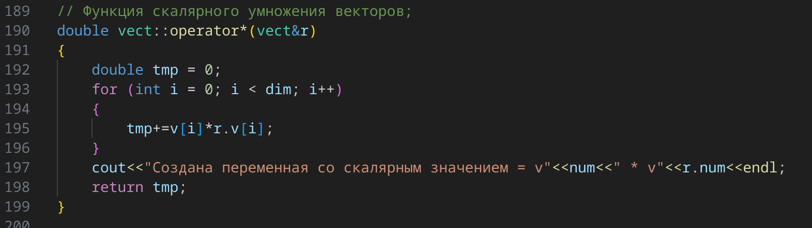

---
## Front matter
title: "Отчет по Лаборатоорной работе №2"
subtitle: "Технология программирования"
author: "Бекауов Артур Тимурович"

## Generic otions
lang: ru-RU
toc-title: "Содержание"

## Bibliography
bibliography: bib/cite.bib
csl: pandoc/csl/gost-r-7-0-5-2008-numeric.csl

## Pdf output format
toc: true # Table of contents
toc-depth: 2
lof: true # List of figures
lot: true # List of tables
fontsize: 12pt
linestretch: 1.5
papersize: a4
documentclass: scrreprt
## I18n polyglossia
polyglossia-lang:
  name: russian
  options:
	- spelling=modern
	- babelshorthands=true
polyglossia-otherlangs:
  name: english
## I18n babel
babel-lang: russian
babel-otherlangs: english
## Fonts
mainfont: PT Serif
romanfont: PT Serif
sansfont: PT Sans
monofont: PT Mono
mainfontoptions: Ligatures=TeX
romanfontoptions: Ligatures=TeX
sansfontoptions: Ligatures=TeX,Scale=MatchLowercase
monofontoptions: Scale=MatchLowercase,Scale=0.9
## Biblatex
biblatex: true
biblio-style: "gost-numeric"
biblatexoptions:
  - parentracker=true
  - backend=biber
  - hyperref=auto
  - language=auto
  - autolang=other*
  - citestyle=gost-numeric
## Pandoc-crossref LaTeX customization
figureTitle: "Рис."
tableTitle: "Таблица"
listingTitle: "Листинг"
lofTitle: "Список иллюстраций"
lotTitle: "Список таблиц"
lolTitle: "Листинги"
## Misc options
indent: true
header-includes:
  - \usepackage{indentfirst}
  - \usepackage{float} # keep figures where there are in the text
  - \floatplacement{figure}{H} # keep figures where there are in the text
---

# Цель работы

Целью работы является написание программы на с++, содержащей описание классов vect и matr, конструкторы и деструктор для каждого класса, набор оператор-функций для операций векторной алгебры и функцию main, использующую вышеописанный инструментарий.

# Ход лабораторной работы

**Описание классов**

Программа, написанная мной задаёт классы vect и matr. 
Экземплярами vect (Рис. @fig:1), будут векторы, описываемые четырьмя полями - размерность int dim (целое число), значение double*v (указатель на одномерный массив), номер вектора int num (целое число), и статической переменной static int count, которая ведёт общий счёт созданных векторов.

Затем описаны конструкторы и деструктор:

-vect(); - конструктор по умолчанию (создаёт единичный вектор размера 3).

-vect(vect&x); - конструктор копирования. 

-vect(int n); - конструктор создания нулевого вектора размера n.

-vect(int n, double*x); - конструктор создания вектора с заданными значениями

-~vect(); - деструктор вектора

После этого перечисленны методы класса vect и дружественные функции:

-void print(); - функция вывода вектора.

-vect operator+(vect r); - функция сложения векторов (бинарная).

-friend vect operator-(vect&l,vect&r); - друж. функция вычитания векторов (бинарная).

-vect operator-(); - функция  вычитания вектора (унарная).

-vect operator=(const vect&r); - функция присвоения вектору значения другого вектора.

-double operator*(vect&r); - функция скалярного умножения векторов.

-friend vect operator*(double k, vect&r); - друж. функция умножения вектора на число k.

Далее описан дружественный класс matr. Сделанно это, потому что в классе matr появится метод, которому нужен будет доступ к внутренним данным класса vect (а именно к значениям вектора).

Сразу после описания класса я определил и описал статическую переменную count = 0, для её корректного функционирования внутри main.

{#fig:1}

Экземплярами matr(Рис. @fig:2), будут квадратные матрицы, описываемые четырьмя полями (хотя можно обойтись и первыми двумя) - размерность int dim (целое число), значение double**v (указатель на массив указателей на массивы вещ. чисел  - т.е двумерный массив вещ. чисел), номер матрицы int num (целое число), и статической переменной static int count, которая ведёт общий счёт созданных матриц.

Затем описаны конструкторы:

-matr(); - конструктор по умолчанию (создаёт единичную матрицу 3х3).

-matr(matr&x); - конструктор копирования.

-matr(int n); - конструктор создания нулевой матрицы размера nxn.

-matr(int n, double**x); - конструктор создания матрицы nxn с заданными компонентами.

-~matr(); - деструктор матрицы.

После этого перечисленны методы класса matr и дружественные функции:

-void print(); - функция вывода матрицы.

-matr operator+(matr r); - функция сложения матриц.

-matr operator-(matr&r); - функция вычитания матриц (бинарная).

-matr operator-(); - функция вычитания матрицы (унарная).

-matr operator=(const matr r); - функция присвоения матрице значения другой матрицы.

-matr operator*(matr&r); - функция перемножения матриц.

-friend matr operator*(double k, matr&r); - друж. функция умножения матрицы на число.

-vect operator*(vect&r); - функция умножения матрицы на вектор столбец (результатом будет вектор).

Затем я, конечно, определил и описал статическую переменную count = 0.

{#fig:2}

**Описание конструкторов, деструктора и методов класс vect**

Описание я начал с конструктора вектора по умолчанию (Рис. @fig:3). 
Так как это конструктор, то первым делом я увеличил значение count на 1 (потому что всякий раз, когда вызывается конструктор - создаётся новый вектор). Присвоил парамеру num создаваемого новое значение count. Таким образом созданный вектор получил свой уникальный номер, по которому я смогу к нему обращаться в описаниях действий конструкторов, деструкторов и методов класса vect (в том числе и при выводе вектора). 
Затем параметру dim задаю значение 3. А параметру v c помощью оператора new задаю значение указателя на динамическую память в которой находится массив размером в dim вещественных чисел. Далее с помощью цикла for заполняю массив единицами. В конце вывожу сообщение, что конструктор по умолчанию создал вектор №num. Таким образом, конструктор по умолчанию создал единичный вектор размерностью 3. (Как пример - v1(1,1,1)).

{#fig:3}

После - я описал конструктор копирования вектора (Рис. @fig:4), который получает на вход ссылку на объект класса vect - r.
Увеличиваю значение count на 1 и присваиваю его параметру num. Затем пареметру dim присваиваю значение dim вектора r (r.dim). Выделяем динамическую память под массив v, и каждому из значений массива v[i] присваиваю соответствующее значение r.v[i]. В конце вывожу сообщение, что конструктор копирования создал вектор №num. Таким образом, конструктор по умолчанию создал вектор-копию r.

{#fig:4}

Далее я описал конструктор создания нулевого вектора (Рис. @fig:5), который получает на вход целое число n - размер будущего вектора.
Увеличиваю значение count на 1 и присваиваю его параметру num. Затем параметру dim присваиваю значение n. Выделяем динамическую память под массив v, и каждому из значений массива v[i] присваиваю значение 0. В конце вывожу сообщение, что конструктор создания нулевого вектора создал вектор №num. Таким образом, конструктор создания нулевого вектора создал нулевой вектор размерностью n.

{#fig:5}

После - я описал конструктор создания вектора с компонентами (Рис. @fig:6), который полуает на вход целое число n - размер будущего вектора и указатель на массив вещественных числе *x - компоненты будущего вектора.
Увеличиваю значение count на 1 и присваиваю его параметру num. Затем пареметру dim присваиваю значение n. Выделяем динамическую память под массив v, и каждому из значений массива v[i] присваиваю значение x[i]. В конце вывожу сообщение, что конструктор создания вектора с компонентами создал вектор №num. Таким образом, конструктор создания вектора с компонентами создал вектор размерностью n, с компонентами массива x.

{#fig:6}

Далее я описал деструктор вектора (Рис. @fig:7).
С помощью оператора delete освобождаю динамическую память, на которую указывет указатель v. Параметру dim присваиваю значеник 0. В конце вывожу сообщение, что деструктор вектора ликвидировал вектор №num. Таким образом деструктор вектора ликвидировал вектор №num и освободил соотствующую ему динамическую память.

{#fig:7}

Затем я описал функцию вывода вектора (Рис. @fig:8).
Вывожу сообщение, указывающее номер выводимого вектора и его размерность. Потом с помощью цикла for вывожу каждое из значений компонент вектора.

{#fig:8}

После - я описал функция сложения векторов (Рис. @fig:9), которая получает на вход вектор r (Функция бинарная, первый (левый вектор) - тот, к которму применяется данный метод).
С помощью конструктора создания нулевого вектора создаю вектор tmp размерностью dim. Далее в цикле for меняю значения массива tmp.v[i]=0 на сумму v[i]+r.v[i]. В конце вывожу сообщение, что создан вектор со значением суммы векторов №num + №r.num. ("Создан" я написал потому, что вектор tmp внутри данного метода действительно создаётся конструктором копирования). Возвращается вектор tmp (Результатом работы метода является объект класса vect).

{#fig:9}

Затем я описал функцию бинарного вычитания векторов (Рис. @fig:10), которая получает на вход ссылки на уменьшаемый вектор l и вычитаемый вектор r. 
С помощью конструктора создания нулевого вектора создаю вектор tmp размерностью l.dim. Далее в цикле for меняю значения массива tmp.v[i]=0 на разность l.v[i]-r.v[i]. В конце вывожу сообщение, что создан вектор со значением разности векторов №l.num - №r.num.Возвращается вектор tmp.

{#fig:10}

Потом я описал функцию унарного вычитания вектора (Рис. @fig:11).
С помощью конструктора создания нулевого вектора создаю вектор tmp размерностью dim. Далее в цикле for меняю значения массива tmp.v[i]=0 на -1 * v[i]. В конце вывожу сообщение, что создан вектор со значением -1 * №num.Возвращается вектор tmp.

{#fig:11}

После этого я описал функцию присвоения вектору значения другого вектора (Рис. @fig:12), которая получает на вход ссылку на const вектор r.
Параметру dim вектора, к которому применён метод, задаём значение r.dim. Затем с помощью цикла for значениям v[i] присваиваем r.v[i]. В конце вывожу сообщение, что вектору num присвоено значение вектора r.num. Возвращается вектор, к которому применён метод (с помощью указателя this).

{#fig:12}

Далее я описал функцию скалярного умножения векторов (Рис. @fig:13), которая получает на вход ссылку на вектор r.
Объявляю и описываю вещественное число tmp = 0. Потом с помощью цикла for, суммирую в tmp все произведения вида v[i]*r.v[i]. В конце вывожу сообщение, что создана скалярная переменная со значением №num * №r.num. Возвращаю значение tmp.

{#fig:13}

Затем я описал функцию умножения вектора на число (Рис. @fig:14), которая получает на вход вещественное число k, и ссылку на вектор r.
С помощью конструктора создания нулевого вектора создаю вектор tmp размерностью r.dim. Далее в цикле for меняю значения массива tmp.v[i]=0 на k * r.v[i]. В конце вывожу сообщение, что создан вектор со значением k * №num.Возвращается вектор tmp.

{#fig:14}

**Описание конструкторов, деструктора и методов класс matr**

Описание я начал с конструктора матрицы по умолчанию (Рис. @fig:15). 
Увеличиваю значение count на 1 и присваиваю его параметру num. Затем пареметру dim присваиваю значение 3 (таким образом матрица будет 3х3). А параметру v c помощью оператора new задаю значение указателя на динамическую память в которой находится массив размером в dim из указателей на массивы вещественных чисел - таким образом v - указатель на двумерный массив вещественных чисел. Далее с помощью двух циклов for заполняю массив единицами по основной диагонали (где i=j, т.е номер строки равен номеру ряда) и нулями на всех остальных позициях. Таким образом, конструктор по умолчанию создал единичную матрицу размерностью 3х3.

{#fig:15}

После - я описал конструктор копирования матрицы (Рис. @fig:16), который получает на вход ссылку на объект класса matr - r.
Увеличиваю значение count на 1 и присваиваю его параметру num. Затем параметру dim присваиваю значение dim матрицы r (r.dim). Выделяем динамическую память под двумерный массив v, и каждому из значений массива v[i][j] присваиваю соответствующее значение r.v[i][j]. Таким образом, конструктор по умолчанию создал матрицу-копию r.

{#fig:16}

Далее я описал конструктор создания нулевой матрицы (Рис. @fig:17), который получает на вход целое число n - размер будущей матрицы.
Увеличиваю значение count на 1 и присваиваю его параметру num. Затем пареметру dim присваиваю значение n. Выделяем динамическую память под двумерный массив v, и каждому из значений массива v[i][j] присваиваю значение 0. Таким образом, конструктор создания нулевой матрицы создал нулевую матрицу размерностью nхn.

{#fig:17}

После - я описал конструктор создания матрицы с компонентами (Рис. @fig:18), который полуает на вход целое число n - размер будущей матрицы и указатель на двумерный массив вещественных числе **x - компоненты будущей матрицы.
Увеличиваю значение count на 1 и присваиваю его параметру num. Затем пареметру dim присваиваю значение n. Выделяем динамическую память под двумерный массив v, и каждому из значений массива v[i][j] присваиваю значение x[i][j]. Таким образом, конструктор создания матрицы с компонентами создал матрицу размерностью nxn, с компонентами двумерного массива x.

{#fig:18}

Далее я описал деструктор матрицы (Рис. @fig:19).
С помощью цикла for и оператора delete освобождаю динамическую память, на которую указывет указатель v. Таким образом деструктор вектора ликвидировал матрицу №num и освободил соотствующую ей динамическую память.

{#fig:19}

Затем я описал функцию вывода матрицы (Рис. @fig:20).
Вывожу сообщение, указывающее номер выводимой матрицы и её размерность. Потом с помощью двух циклов for вывожу каждое из значений компонент матрицы.

{#fig:20}

После - я описал функцию сложения матриц (Рис. @fig:21), которая получает на вход матрицу r.
С помощью конструктора создания нулевой матрицы создаю матрицу tmp размерностью dimxdim. Далее в цикле for меняю значения массива tmp.v[i][j]=0 на сумму v[i][j]+r.v[i][j]. Возвращается матрица tmp (Результатом работы метода является объект класса matr).

{#fig:21}

Затем я описал функцию бинарного вычитания матриц (Рис. @fig:22), которая получает на вход ссылку на вычитаемую матрицу r. 
С помощью конструктора создания нулевой матрицы создаю матрицу tmp размерностью dimxdim. Далее в циклах for меняю значения массива tmp.v[i][j]=0 на разность v[i][j]-r.v[i][j]. Возвращается матрица tmp.

{#fig:22}

Потом я описал функцию унарного вычитания матрицы (Рис. @fig:23).
С помощью конструктора создания нулевой матрицы создаю матрицу tmp размерностью dimxdim. Далее в циклах for меняю значения массива tmp.v[i]=0 на -1 * v[i]. Возвращается матрица tmp.

{#fig:23}

После этого я описал функцию присвоения матрице значения другой матрицы (Рис. @fig:24), которая получает на вход ссылку на const матрицу r.
Параметру dim матрицы, к которому применён метод, задаём значение r.dim. Затем с помощью циклов for значениям v[i][j] присваиваем r.v[i][j].  Возвращается матрица, к которой применён метод (с помощью указателя this).

{#fig:24}

Далее я описал функцию перемножения матриц (Рис. @fig:25), которая получает на вход ссылку на матрицу r.
С помощью конструктора создания нулевой матрицы создаю матрицу tmp размерностью dimxdim. Далее с помощью трёх циклов for в каждом значении tmp.v[i][j] суммируем значения вида v[i][k]*r.v[k][j] (где k принадлежит [0;dim-1]). Возвращается матрица tmp.

{#fig:25}

Затем я описал функцию умножения матрицы на число (Рис. @fig:26), которая получает на вход вещественное число k, и ссылку на матрицу r.
С помощью конструктора создания нулевой матрицы создаю матрицу tmp размерностью r.dimxr.dim. Далее в циклах for меняю значения массива tmp.v[i][j]=0 на k * r.v[i][j]. Возвращается матрица tmp.

{#fig:26}

Затем я описал функцию умножения матрицы на вектор-столбец (Рис. @fig:27), которая получает на вход ссылку на вектор r.
С помощью конструктора создания нулевого вектора создаю вектор tmp размерностью dim. Далее в циклах for меняю значения вектора tmp.v[i]=0 на сумму всех элементов вида v[i][j]*r.v[i] (где j принадлежит [0;dim-1]). Возвращается вектор tmp.

{#fig:27}

**Функция main**

В функции main я привёл пример работы каждого конструктора и метода классов vect и matr. Также привёл 2 более сложных примера, показывающих, что работает двойное присваивание и сложные операции. ( К примеру matr1 + 3*mart2).

# Выводы

В ходе лабораторной работы я написал программу на с++, содержащую описание классов vect и matr, конструкторы и деструктор для каждого класса, набор оператор-функций для операций векторной алгебры и функцию main, использующую вышеописанный инструментарий.

