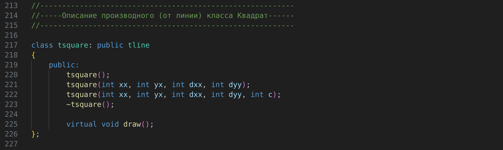
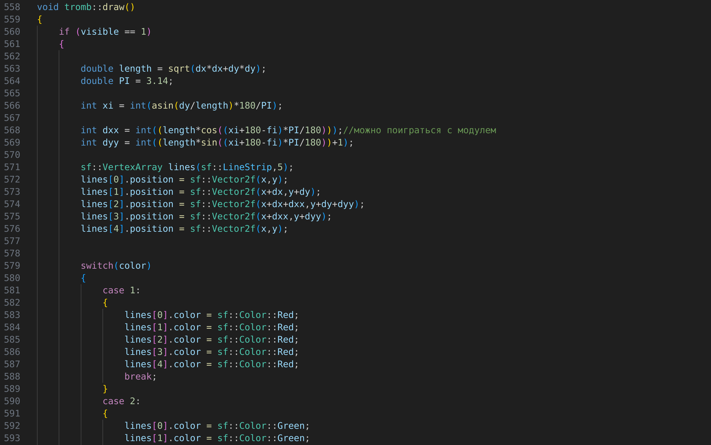

---
## Front matter
title: "Отчет по Лаборатоорной работе №3"
subtitle: "Технология программирования"
author: "Бекауов Артур Тимурович"

## Generic otions
lang: ru-RU
toc-title: "Содержание"

## Bibliography
bibliography: bib/cite.bib
csl: pandoc/csl/gost-r-7-0-5-2008-numeric.csl

## Pdf output format
toc: true # Table of contents
toc-depth: 2
lof: true # List of figures
lot: true # List of tables
fontsize: 12pt
linestretch: 1.5
papersize: a4
documentclass: scrreprt
## I18n polyglossia
polyglossia-lang:
  name: russian
  options:
	- spelling=modern
	- babelshorthands=true
polyglossia-otherlangs:
  name: english
## I18n babel
babel-lang: russian
babel-otherlangs: english
## Fonts
mainfont: PT Serif
romanfont: PT Serif
sansfont: PT Sans
monofont: PT Mono
mainfontoptions: Ligatures=TeX
romanfontoptions: Ligatures=TeX
sansfontoptions: Ligatures=TeX,Scale=MatchLowercase
monofontoptions: Scale=MatchLowercase,Scale=0.9
## Biblatex
biblatex: true
biblio-style: "gost-numeric"
biblatexoptions:
  - parentracker=true
  - backend=biber
  - hyperref=auto
  - language=auto
  - autolang=other*
  - citestyle=gost-numeric
## Pandoc-crossref LaTeX customization
figureTitle: "Рис."
tableTitle: "Таблица"
listingTitle: "Листинг"
lofTitle: "Список иллюстраций"
lotTitle: "Список таблиц"
lolTitle: "Листинги"
## Misc options
indent: true
header-includes:
  - \usepackage{indentfirst}
  - \usepackage{float} # keep figures where there are in the text
  - \floatplacement{figure}{H} # keep figures where there are in the text
---

# Цель работы

Написать компьютерную программу, содержащую описание классов для иерархии геометрических объектов (точка, линия, квадрат, ромб, прямоугольник, параллелограмм) с реализацией набора методов (изобразить, убрать, передвинуть, повернуть).

# Ход лабораторной работы

**Описание абстрактного класса grobject**

Программа, написанная мной задаёт классы grobject, tline, tsquare, trekt, tromb, tpar.

Первым делом я создал окно вывода размером 1000 на 1000 пикселей, с заголовком `SFML`(Рис. @fig:1). Я сделал это до описания всех классов, потому что почти все они используют окно в функции draw.

{#fig:1}

Затем я описал grobject - базовый, абстрактный класс (Рис. @fig:2), поэтому экземпляров у него нет. Описывается четырьмя полями - начальная координата x `int x`, начальная координата y `int y`, цвет `int color` и видимость `int visible`.

{#fig:2}

По существу класс grobject задаёт начальную точку цвет и видимость - параметры, которые унаследуют остальные классы.

Далее прописаны конструкторы и деструктор, вообще для абстрактного класса это не обязательно, но так как я переписывал абстрактный класс grobject из обычного класса point, у меня уже были конструкторы и деструктор, я решил их просто не убирать.
Конструкторы и деструктор:

-grobject(); - конструктор по умолчанию (x=500, y=500, color=1, visible=1).

-grobject(int xx, int yy); - конструктор c заданными x, y (x=xx, y=yy, color=1,visible=1). 

-grobject(int xx, int yy, int c); - конструктор c заданными x, y, color (x=xx, y=yy, color=c, visible=1).

-~grobject(); - деструктор.

После этого перечисленны методы абстрактного класса grobject (Рис. @fig:3):

-virtual void draw() = 0; - чисто виртуальный метод draw - именно его наличие определяет класс grobject как абстрактный. В производных классах её придётся переопределять, в отличии от трёъ других функций, которые будут унаследованы всеми остальными классами.

-void hide(); - метод, который отключает видимость объекта, т.е он не будет отрисовываться на экране.

-void reveal(); - метод, который включает видимость объекта. т.е он будет отображаться на экране.

void move(dxx, dyy); - метод, который отклоняет координату начальной точки на dxx и dyy.

{#fig:3}

**Описание производного (от grobject) класса tline**

После этого я описал класс tline (производный от класса grobject) (Рис. @fig:4), экземплярами которого являются прямые линии. Помимо полей описывающих начальную точку, видимость и цвет, унаследованных от класса grobject, класс tline имеет поля задающие конечную точку линии: отклонение конечной точки от начальной по координате x - `int dx` и отклонение конечной точки от начальной по координате y - `int dy`. 

{#fig:4}

Далее прописаны конструкторы и деструктор класса tline

-tline(); - конструктор по умолчанию.

-tline(int xx, int yy, int dxx, int dyy); - конструктор с заданными параметрами x, y, dx, dy.

-tline(int xx, int yy, int dxx, int dyy, int c); - конструктор с заданными параметрами и цветом.

-~tline(); - деструктор.

Затем я прописал методы класса tline(Рис. @fig:5 и Рис. @fig:6). Помимо унаследованных от grobject методов hide, reveal и move, также были добавлены:

-virtual void draw(); - чисто виртуальный метод draw класса grobject был переопределён как виртуальный (фактический) метод draw класса tline. Если visible = 1, метод рисует линию в созданном в начале окне. Цвет линии определяется полем color (1 - красный, 2 - зелёный, 3 - синий, 4 - жёлтый, 5 - чёрный, ост - белый).
(В этом классе и далее метод draw переопределяется как виртуальный. Сделано это для реализации механизма позднего связывания.)

-void rotate(double fi); - метод rotate. Вращает объект вокруг начальной (x,y) по часовой стрелке на угол fi `double fi`. Угол fi указывается в градусах.

{#fig:5}

{#fig:6}

**Описание производного (от tline) класса tsquare**

После этого я описал класс tsquare (производный от класса tline) (Рис. @fig:7), экземплярами которого являются квадраты. Помимо полей описывающих начальную вершину, видимость, цвет и отклонение второй вершины от начальной, унаследованных от tline, класс tsquare не имее уникальных полей.

{#fig:7}

Далее прописаны конструкторы и деструктор класса tsquare:

-tsquare(); - конструктор по умолчанию.

-tsquare(int xx, int yy, int dxx, int dyy); - конструктор с заданными параметрами x, y, dx, dy.

-tsquare(int xx, int yy, int dxx, int dyy, int c); - конструктор с заданными параметрами и цветом.

-~tsquare(); - деструктор.

Затем я прописал методы класса tsquare (Рис. @fig:8 и Рис. @fig:9). Помимо унаследованных от tline методов hide, reveal, move, и rotate, также были добавлены:

--virtual void draw(); - был переопределён виртуальный метод draw. Если visible = 1, метод рисует квадрат в созданном в начале окне. Цвет квадрата определяется полем color.

{#fig:8}

{#fig:9}

**Описание производного (от tsquare) класса trekt**

После этого я описал класс trekt (производный от виртуального класса tsquare)(Рис. @fig:10)(Класс tsquare в наследовании описан как виртуальный, равно как и у tromb. Сделано это потому что класс tpar будет иметь два предка (tromb и trekt), и унаследует два комплекта одинаковых полей tsquare от них. Чтобы избежать путанницы с уканием к какому полю идёт обращение, класс предок объявляется виртуальным, у trekt и tromb). 
Экземплярами класса являются прямоугольники. Помимо полей описывающих начальную вершину, видимость, цвет и отклонение второй вершины от начальной, унаследованных от tsquare, класс trekt имеет поля коэфициентов увеличения первой стороны `float ak` и второй стороны `float bk`. Первой стороной считается сторона между вершинами (x,y) и (x+dx,y+dy). Если ak и bk равны 1, то получается обычный квадрат с теми же параметрами. 

{#fig:10}

Далее прописаны конструкторы и деструктор класса trekt:

-trekt(); - конструктор по умолчанию.

-trekt(int xx, int yy, int dxx, int dyy, float akk, float bkk); - конструктор с заданными параметрами x, y, dx, dy, ak, bk.

-trekt(int xx, int yy, int dxx, int dyy, float akk, float bkk, int c); - конструктор с заданными параметрами и цветом.

-~trekt(); - деструктор.

Затем я прописал методы класса trekt (Рис. @fig:11 и Рис. @fig:12). Помимо унаследованных от tsquare методов hide, reveal, move, и rotate, также были добавлены:

--virtual void draw(); - был переопределён виртуальный метод draw. Если visible = 1, метод рисует прямоугольник в созданном в начале окне. Цвет прямоугольника определяется полем color.

{#fig:11}

{#fig:12}

**Описание производного (от tsquare) класса tromb**

После этого я описал класс tromb (производный от виртульного класса tsquare) (Рис. @fig:13), экземплярами которого являются ромбы. Помимо полей описывающих начальную вершину, видимость, цвет и отклонение второй вершины от начальной, унаследованных от tsquare, класс tromb имеет поле определяющее угол при второй вершине (x+dx,y+dy) `int fi`. Значение угла следует указывать в градусах, желательно от 0 до 180.

{#fig:13}

Далее прописаны конструкторы и деструктор класса tromb:

-tromb(); - конструктор по умолчанию.

-tromb(int xx, int yy, int dxx, int dyy, int fik); - конструктор с заданными параметрами x, y, dx, dy, fi.

-tromb(int xx, int yy, int dxx, int dyy, int fik, int c); - конструктор с заданными параметрами и цветом.

-~tromb(); - деструктор.

Затем я прописал методы класса tromb (Рис. @fig:14 и Рис. @fig:15 и Рис. @fig:16). Помимо унаследованных от tsquare методов hide, reveal, move, и rotate, также были добавлены:

--virtual void draw(); - был переопределён виртуальный метод draw. Если visible = 1, метод рисует ромб в созданном в начале окне. Цвет прямоугольника определяется полем color.

{#fig:14}

{#fig:15}

{#fig:16}

**Описание производного (от trekt и tromb) класса tpar**

После этого я описал класс tpar (производный от классов tromb и trekt) (Рис. @fig:17), экземплярами которого являются параллелограмы. Помимо полей описывающих начальную вершину, видимость, цвет , отклонение второй вершины от начальной, унаследованных от tsquare, класс tpar имеет поля коэфициентов увеличения сторон (унаследованные от trekt) и поле определяющее угол при второй вершине (унаследованное у tromb).

{#fig:17}

Далее прописаны конструкторы и деструктор класса tpar:

-tpar(); - конструктор по умолчанию.

-tpar(int xx, int yy, int dxx, int dyy, float akk, float bkk, int fik); - конструктор с заданными параметрами x, y, dx, dy, ak, bk, fi.

-tpar(int xx, int yy, int dxx, int dyy, float akk, float bkk,int fik, int c); - конструктор с заданными параметрами и цветом.

-~tpar(); - деструктор.

Затем я прописал методы класса tpar (Рис. @fig:18 и Рис. @fig:19 и Рис. @fig:20). Помимо унаследованных от tsquare методов hide, reveal, move, и rotate, также были добавлены:

--virtual void draw(); - был переопределён виртуальный метод draw. Если visible = 1, метод рисует параллелограм в созданном в начале окне. Цвет прямоугольника определяется полем color.

{#fig:18}

{#fig:19}

{#fig:20}

**Функция int main()**

В функции main я создал белую сетку из экземпляров класса tline, а также добавил по 3 экземпляра классов tsquare, tromb, trekt, tpar, один из которых в каждом классе скрываю функцией hide. (Рис. @fig:21 и Рис @fig:22).

После этого я описываю указатель на объект класса квадрат tsquare *fig. Затем я выделяю в динамической памяти объект, являющийся ромбом по умолчанию и присваиваю указателю fig значение этой памяти.

{#fig:21}

{#fig:22}

Далее идёт цикл, который выводит окно вывода на экран, в цикле описаны все выводимые на экран элементы (через функцию draw, ведь именно она отрисовывает объект на экране)(Рис. @fig:23 и Рис @fig:24).

{#fig:23}

{#fig:24}

Вывод программы следующий (Рис. @fig:25):

{#fig:25}

На рисунке отрисовывается третий ромб, значит, несмотря на то, что fig1 - указатель на экземпляр класса квадрат, на этапе позднего связывания программа понимает, что в динамической памяти находятся данные ромба и применяет соответствующий draw - из производного класса ромба.

# Выводы

В ходе лабораторной работы я написал компьютерную программу на с++, содержащую описание классов для иерархии геометрических объектов (точка, линия, квадрат, ромб, прямоугольник, параллелограмм) с реализацией набора методов (изобразить, убрать, передвинуть, повернуть).

